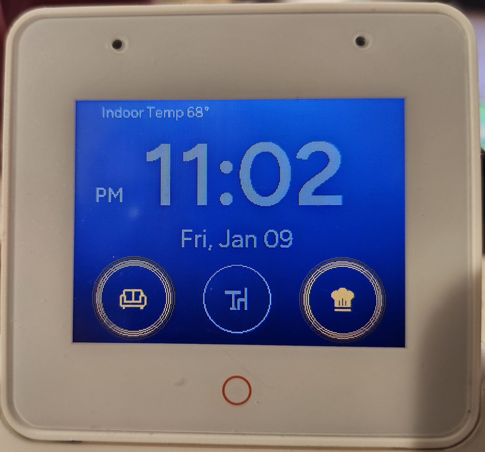
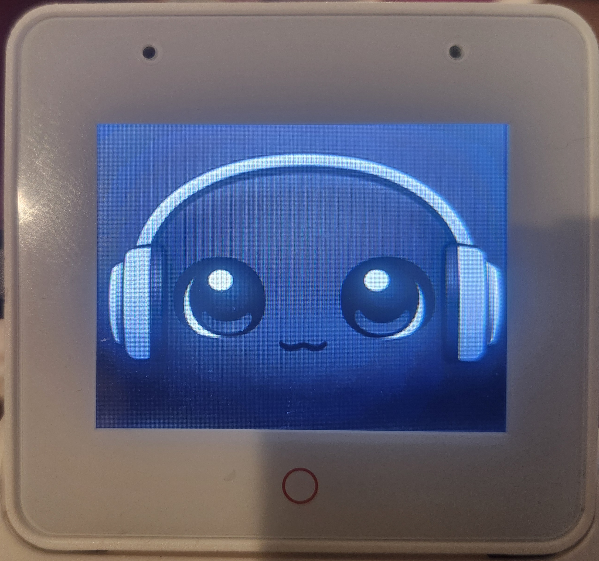
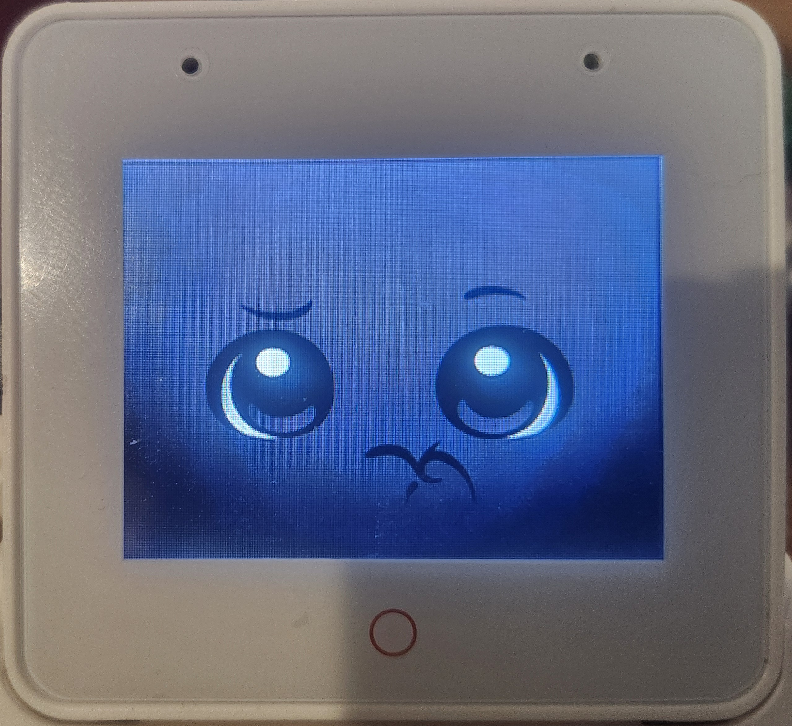
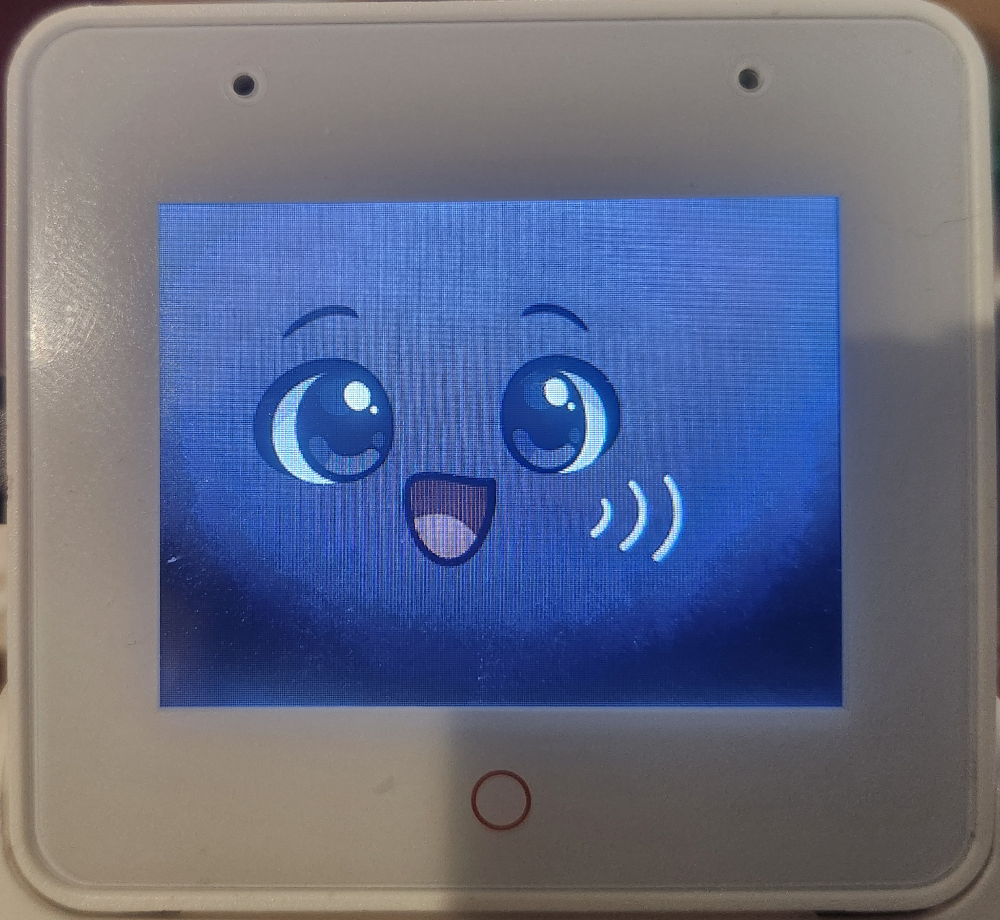
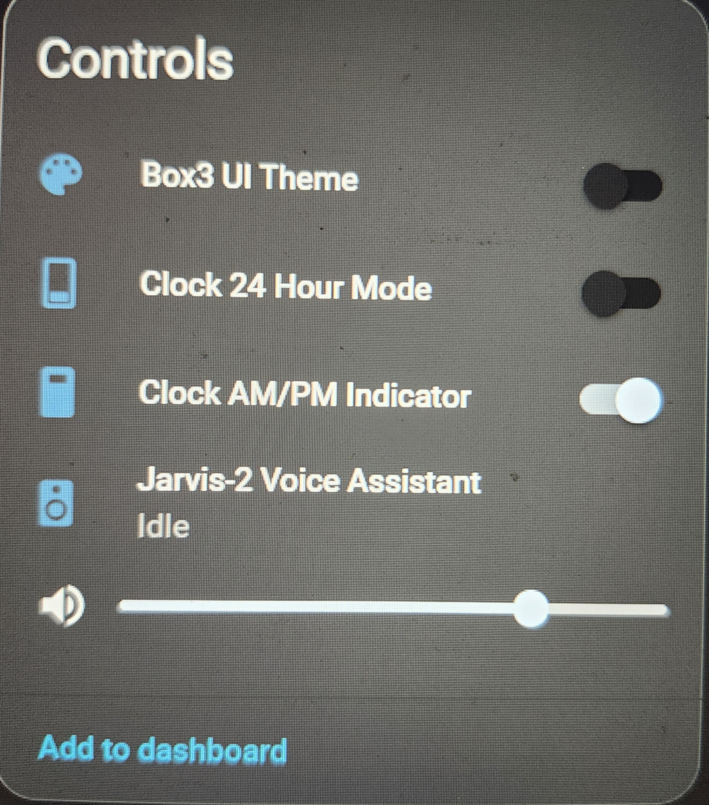
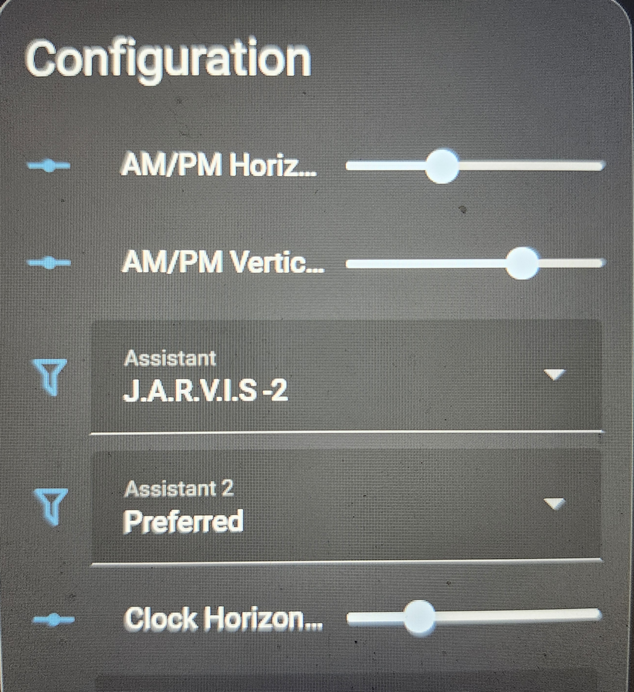

# ESP32-S3-Box-3 HA Touch Dashboard

This repository contains a **custom ESPHome package** for the **ESP32-S3-Box-3**, providing a **stable, wall-friendly touch dashboard** integrated with Home Assistant.

> ✅ **Current Stable Release:**  
> **v0.3.8**

This project is **separate from the Voice Assistant display repository** and follows its own **v0.x.x** versioning.

---

## ✨ Features

### 🔊 On‑Device Audio Earcons (v0.3.8)
- Added **on-device wake acknowledgement sound** played immediately after wake word detection
- Wake sound plays **only when idle** (no sound if already speaking)
- Wake sound plays **before** the voice assistant pipeline starts
- Listening screen flips immediately after wake sound for responsive UX
- Added fully on-device **timer finished** sound (+2 dB for audibility)
- All earcons standardized on **FLAC (48 kHz, mono)** for maximum reliability
- No Home Assistant service calls required for wake or timer audio


### ⚡ Stability First
- Event-driven display redraws (no 1-second redraw loop)
- Debounced redraw requests to prevent UI slowdowns
- Touch input debounced for reliable interaction
- Designed for long-term, always-on wall use

---

### 🕒 Idle Header
Structured, balanced header layout:

```
Indoor Temp    [ HVAC ]    Outdoor Temp
```

- **Indoor Temp** — upper left
- **HVAC Status Icon** — centered  
  - 🔥 Heating → red flame  
  - ❄️ Cooling → blue snowflake  
  - Hidden when idle/off
- **Outdoor Temp** — upper right
- Indoor and outdoor temperatures use the **same font, size, and weight**
- Text color follows the selected UI theme
- HVAC icon colors are **state-driven** and ignore UI theming

---

### 🎨 UI Theme Color
- Virtual RGB light exposed in Home Assistant
- Theme color applies to:
  - Clock
  - Indoor temperature
  - Outdoor temperature
- HVAC icons are never theme-colored

---

### 👆 Touch Buttons
- Bottom-row touch buttons for Home Assistant actions
- Transparent backgrounds for a clean wall-mounted look
- Immediate visual feedback (amber glow) on state change

---

## 🖼️ Screenshots

<p align="center">
  
  
</p>
<p align="center"><em>Idle Screen • Listening</em></p>

<p align="center">
  
  
</p>
<p align="center"><em>Thinking • Speaking</em></p>

<p align="center">
  
  
</p>
<p align="center"><em>Control • Configuration</em></p>

---

## 🎨 Screen Illustrations (Optional)

This dashboard supports **full-screen illustration sets** for visual personality and feedback.

### Available Illustration Packs
- **JARVIS-style**
- **Cute Face-style**

Illustration packs:
https://github.com/mrfixitpa/esp32-s3-box-3/tree/main/illustrations

---

## 📁 Package File

> ⚠️ This repository provides an **ESPHome package**, not a full device configuration.

**Main package file:**
- `box3-ha-touchdash.yaml`

---

## ✏️ Required User Configuration (Before Compiling)

### Indoor Temperature Sensor
```yaml
sensor:
  - platform: homeassistant
    id: avg_indoor_temp
    entity_id: sensor.average_indoor_temperature
    internal: true
```

### Outdoor Temperature Sensor
```yaml
sensor:
  - platform: homeassistant
    id: outdoor_temp
    entity_id: sensor.outdoor_temperature
    internal: true
```

### HVAC Status
```yaml
text_sensor:
  - platform: homeassistant
    id: hvac_action
    entity_id: climate.your_thermostat
    attribute: hvac_action
    internal: true
```

### Touch Button Actions
```yaml
script:
  - id: toggle_living_room_lights
    then:
      - homeassistant.service:
          service: light.toggle
          data:
            entity_id: light.living_room_lights
```

---

## 🌙 Screen Brightness Automation (Recommended)

Use Home Assistant automations to control screen brightness:

https://github.com/mrfixitpa/HA-Code-and-Templates/blob/main/ESP32-S3-Box3-Screen-Brightness-Automation

---

## 🚀 Installation

```yaml
packages:
  box3_touchdash:
    url: github://mrfixitpa/esp32-s3-box-3-ha-touch-dashboard/box3-ha-touchdash.yaml@v0.3.8
```

---

## 📄 License
Provided as-is for personal and educational use.


## Credits
- Wake word acknowledgement sound and timer finished sound are borrowed from the official [Home Assistant Voice PE](https://github.com/esphome/home-assistant-voice-pe) project.
- Coding debugging assistance, and workflow guidance provided with help from OpenAI ChatGPT.
